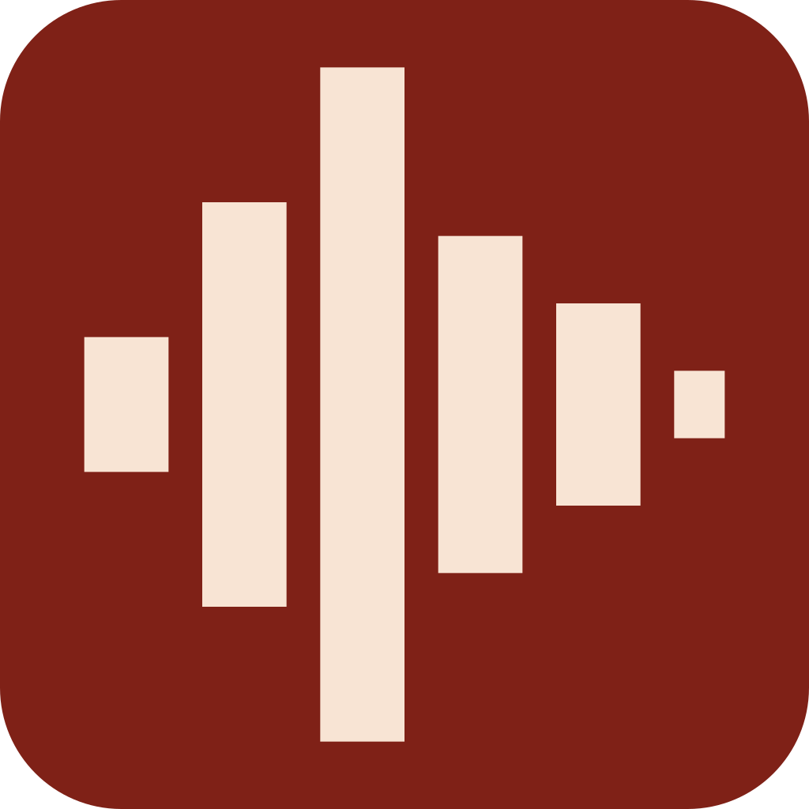

# kleeamp

[](https://discord.gg/4VpCzXPuj2)

Terminal soul, native body. kleeamp is an Android player for internet radio,
podcasts and the music servers you host yourself.

This is the phone client of [cliamp](https://github.com/bjarneo/cliamp),
the terminal music player. It keeps the look and the self-hosted sources of
the desktop player. Compose draws them instead of a TTY.



## What it plays

- **Radio.** The 15 channels of [cliamp radio](https://radio.cliamp.stream) with
  live listener counts, plus the 53,000-station
  [Radio Browser](https://www.radio-browser.info/) directory.
- **Podcasts.** Search the iTunes directory, subscribe, download episodes for
  offline playback.
- **Your servers.** Navidrome and other Subsonic servers, Jellyfin, Emby, Plex,
  Audiobookshelf, Lyrion, and plain SSH over SFTP. Add as many accounts as you
  want. Credentials go into the Android Keystore, never into a plain file.
- **Local files** on the phone.

Playback runs in a `MediaSessionService`, so the lockscreen, the notification,
the home screen widget and Bluetooth all drive the same player. There is a real
FFT spectrum, a 7-band equaliser, ListenBrainz scrobbling and 27 themes.

See [Playback and Up next](docs/queue-behavior.md) for queue ordering, switching
lists, podcasts, radio, and clearing the queue.

## Install

Get the APK from [releases](https://github.com/cliamp/kleeamp/releases),
or:

```sh
gh release download --repo cliamp/kleeamp --pattern "*.apk"
adb install -r kleeamp-*.apk
```

To build it yourself, read [`android/README.md`](android/README.md).

## Repository layout

One platform per directory. There is no build at the root. Each client builds on
its own terms, and nothing at the top level has to know about any of them.

| Directory | What is in it |
| --- | --- |
| [`android/`](android) | The app. Kotlin, Compose, Media3. Shipping. Its README has the build instructions and the decisions behind the code. |
| [`ios/`](ios) | Nothing yet. |
| [`desktop/`](desktop) | Nothing yet. The desktop player is [cliamp](https://github.com/bjarneo/cliamp) itself. |
| [`docs/`](docs) | [`design.md`](docs/design.md) is the design system the clients build to. [`concept.md`](docs/concept.md) and the artboards are where it started. |

The clients share a design system, a palette set and a vocabulary of screens.
They do not share code, because nothing about Compose survives a trip to Swift.
What is worth keeping together is [`docs/`](docs), one issue tracker, and one
place to notice when a client grows something the others should have too.

## Licence

Free to use, copy and modify for yourself. You may not distribute it, sell it
or sublicense it. Read [`LICENSE`](LICENSE). It is the MIT License with those
three rights removed.

Bundled third-party components keep their own terms, listed in
[`THIRD-PARTY-NOTICES.md`](THIRD-PARTY-NOTICES.md) and [`licenses/`](licenses).
